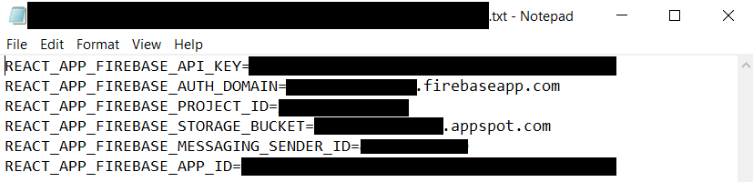
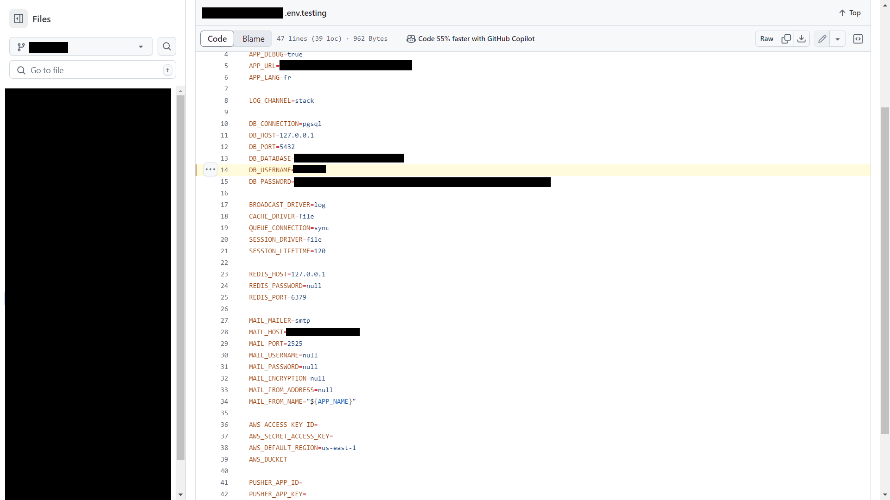
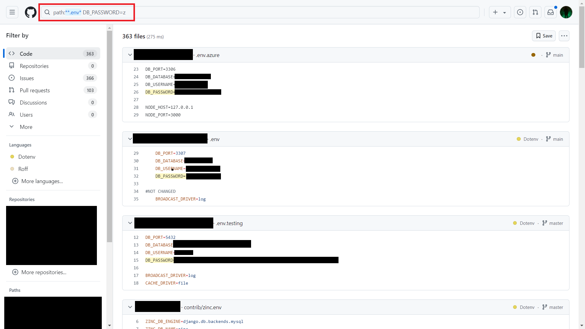
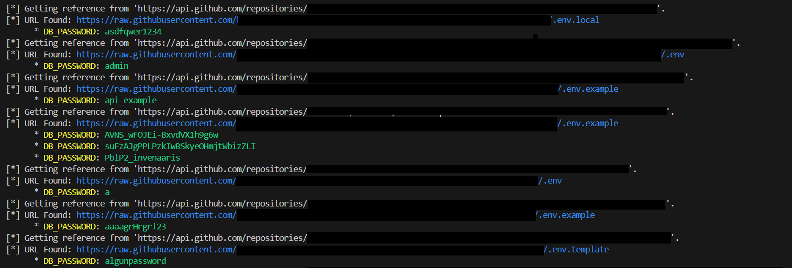

# How to Find Leaked API Keys with Lock-Picker

An API key is essentially a **password** that grants you access to the functionalities of an API. For example, a Twilio API key allows you to send SMS messages, a Firebase API key provides access to the database, and a Stripe API key gives access to financial accounts.

To store API keys, most developers use '.env' files, which link environment variables to API keys. When accessing an API key, the server reads the associated environment variables.

Typically, '.env' files are not meant to be publicly visible. However, if a developer pushes a project to a public Git repository without removing this file, it exposes the API keys to everyone.

Because services require API keys to be stored in specific environment variables, we can search for these environment variables to find potentially leaked API keys.

To demonstrate this type of attack, I created a tool that searches for API keys from environment variables using the GitHub API. This tool, called 'Lock-Picker,' first generates numerous search queries related to the environment variable you specify and then extracts API keys from the search results.

...

Imagine this: what if someone had access to enough API keys to send an SMS to every single person in an entire country? One message, everywhere, all at once—planted in millions of minds, unstoppable. Now, what if they could move money, not just to individuals, but to the entire country’s economy, in one silent, uncontrollable flood? Could this power shift societies overnight? Could it quietly tip the balance of the world?

..

Anyone can install the tool via pip and find public API keys in seconds:
> pip install lock-picker

With this tool, you can scan for environment variables and store the API keys found:
> lock-picker ENV_VARIABLE -o api_keys.txt

Capture API keys of a specific size (for example, 40 bytes):
> lock-picker ENV_VARIABLE -s 40

Or dump all '.env' files to a folder:
> lock-picker ENV_VARIABLE --dump folder_name

To make this tool work, you will need to create a '.env' file with the following environment variable:
'''
GITHUB_API_KEY=XXXXXXXXXXXXXXXXXXXXXXXXXXXXXXXXXXXXXX
'''
(But please, do not expose it.)

It’s free to create an account on [Github](https://github.com/), and you can check out the source code of Lock-Picker [here](https://github.com/42zen/lock-picker).

By [Zen](https://www.linkedin.com/in/mathias-bochet/).